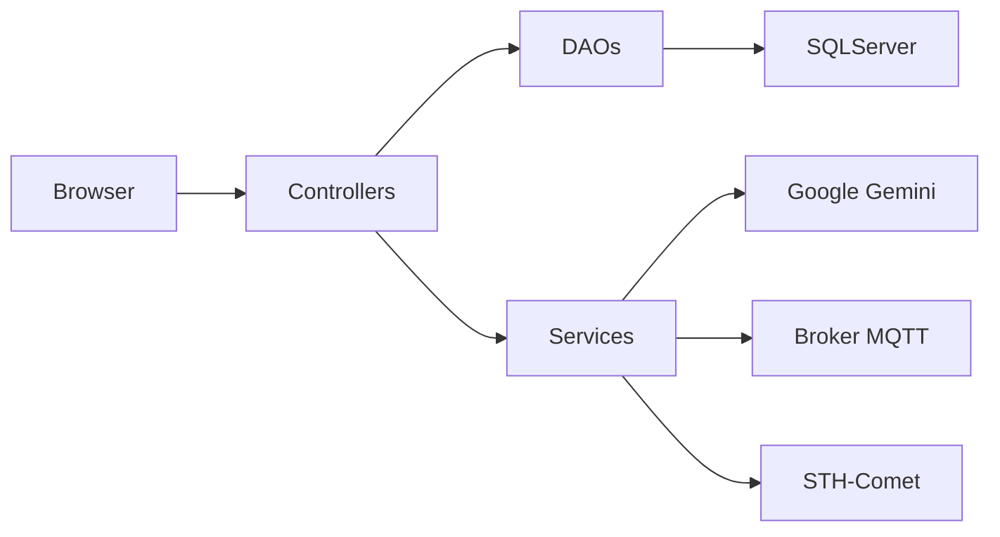

# Documentação do Projeto — Aquamarine (PBL)

Esta documentação consolida a análise e explicação completa do projeto Aquamarine, gerada automaticamente a partir do código-fonte. Use-a para apresentação, leitura técnica e referência rápida.

**Conteúdo**
- Visão Geral
- Inicialização e Configuração
- Arquitetura
- Controllers (descrição e responsabilidades)
- DAOs (persistência)
- Models / ViewModels
- Services (integrações externas)
- Views e fluxo de telas (UX)
- API REST (endpoints, payloads)
- Banco de Dados (tabelas e procedures essenciais)
- Pontos fortes
- Limitações e riscos
- Roteiro de demo (5–7 minutos)
- Passos rápidos para rodar localmente
- Lista de arquivos-chave

---

**Visão Geral**

Aquamarine é uma aplicação web ASP.NET Core 3.1 para gerenciamento de aquários inteligentes. Reúne autenticação, CRUDs de aquários e peixes (com fotos), integração com IA (Google Gemini) para sugerir parâmetros ambientais, dashboard de leituras IoT (FIWARE/STH-Comet ou SQL legado) e controle de Smart Lamp via MQTT.

---

**Inicialização e Configuração**

- Arquivo principal: [PBL/PBL/Program.cs](PBL/PBL/Program.cs) — carrega `.env` (GEMINI_API_KEY) e inicia o host.
- Pipeline e DI: [PBL/PBL/Startup.cs](PBL/PBL/Startup.cs) — registro dos serviços, sessão e Swagger.
- Configurações: [PBL/PBL/appsettings.json](PBL/PBL/appsettings.json) — modelo IA, broker MQTT, FIWARE.
- Perfil de execução: [PBL/PBL/Properties/launchSettings.json](PBL/PBL/Properties/launchSettings.json).

Requisitos básicos: .NET SDK compatível com netcoreapp3.1, SQL Server, (opcional) chave da IA no `.env` para usar Google Gemini.

---

**Arquitetura**

- Padrão: ASP.NET Core MVC. Camadas: Views (Razor) → Controllers → Services (integrações) / DAOs → Banco de dados (Stored Procedures).
- Dependências: Google.GenAI (Gemini), MQTTnet, Swashbuckle, System.Data.SqlClient.

Diagrama resumido:



---

**Controllers — responsabilidades**

- `PBL/PBL/Controllers/PadraoController.cs` — controller base genérico para CRUDs; contém validações comuns e fluxo de Create/Edit/Delete/Save.
- `PBL/PBL/Controllers/LoginController.cs` — login, cadastro, verificação AJAX de e-mail e logout. Usa sessão para marcar `Logado`, `UsuarioId`, `UsuarioNome`.
- `PBL/PBL/Controllers/HomeController.cs` — menu inicial e informações do usuário.
- `PBL/PBL/Controllers/AquarioController.cs` — CRUD de aquários; vincula aquário ao usuário logado; valida nome, capacidade e tipo.
- `PBL/PBL/Controllers/PeixeController.cs` — CRUD de peixes; upload de foto; integra `FishAiService` para detectar parâmetros por imagem ou espécie; aplica alvos na Smart Lamp após salvar.
- `PBL/PBL/Controllers/ConsultaController.cs` — páginas de consulta (peixes e leituras) com endpoints Ajax parciais.
- `PBL/PBL/Controllers/DashboardController.cs` — dashboard de leituras com carregamento Ajax; usa `FiwareSthCometService`.
- `PBL/PBL/Controllers/SmartLampController.cs` — personalização da lâmpada (modo, brilho, RGB) e envio MQTT.
- `PBL/PBL/Controllers/SobreController.cs` — página institucional.
- `PBL/PBL/Controllers/Api/LeiturasController.cs` — API pública para GET/POST de leituras IoT (documentada no Swagger).

---

**DAOs e Persistência**

- Conexão: `PBL/PBL/DAO/ConexaoBD.cs` — `GetConexao()` com string de conexão atualmente hardcoded.
- Helper: `PBL/PBL/DAO/HelperDAO.cs` — executa SQL direto e Procedures, abstraindo `SqlConnection`, `SqlCommand`, `SqlDataAdapter`.
- DAO Base: `PBL/PBL/DAO/PadraoDAO.cs` — generic CRUD via Stored Procedures (spInsert_, spUpdate_, spListagem, spConsulta, spDelete, spProximoId).
- DAOs específicos:
  - `PBL/PBL/DAO/AquarioDAO.cs`
  - `PBL/PBL/DAO/PeixeDAO.cs`
  - `PBL/PBL/DAO/LeituraSensorDAO.cs`
  - `PBL/PBL/DAO/SmartLampConfigDAO.cs` (gera/consulta/salva configs)
  - `PBL/PBL/DAO/UsuarioDAO.cs`

Observação: o projeto prefere Stored Procedures (evita concatenação), e `PadraoDAO` centraliza mapeamento DataRow → ViewModel.

---

**Models / ViewModels**

- `PBL/PBL/Models/PadraoViewModel.cs` — base `Id`.
- `PBL/PBL/Models/UsuarioViewModel.cs` — `Nome`, `Login`, `Senha`.
- `PBL/PBL/Models/AquarioViewModel.cs` — `Nome`, `CapacidadeLitros`, `TipoAgua`, `UsuarioId`.
- `PBL/PBL/Models/PeixeViewModel.cs` — `Nome`, `Especie`, `NomeCientifico`, `TamanhoCm`, `AquarioId`, `Foto`, `Parameters` (instância de `FishParametersViewModel`).
- `PBL/PBL/Models/FishParametersViewModel.cs` — propriedades de temperatura/luz/TDS/salinidade/volume e `IsValid()` para coerência.
- `PBL/PBL/Models/LeituraSensorViewModel.cs` — campos vindos do FIWARE ou do SQL (temp, tds, salinidade, ldr, nivel, volume, data, qualidade).
- `PBL/PBL/Models/SmartLampConfigViewModel.cs` — `Modo`, `Brilho`, `R,G,B`, `LuzAlvo`, `TempAlvo`, `AtualizadoEm`.
- `PBL/PBL/Models/Api/*` — `LeituraIoTRequest`, `LeituraRegistroResponse`, `ApiErrorResponse` para contratos da API.

---

**Services (integrações externas)**

- `PBL/PBL/Services/FishAiService.cs` — encapsula Google Gemini (via `Google.GenAI`) para analisar imagem ou espécie e retornar JSON com parâmetros. Busca chave em variáveis de ambiente (`GEMINI_API_KEY`, etc.) ou config. Gera hash do arquivo para rastreabilidade e exige JSON estrito no retorno.

- `PBL/PBL/Services/SmartLampMqttService.cs` — cliente MQTT via `MQTTnet`. Publica mensagens (payloads simples como `setMode|4`, `setBrightness|80`, `setRGB|r,g,b`) usando WebSocket para o broker especificado em `appsettings.json`.

- `PBL/PBL/Services/FiwareSthCometService.cs` — consulta vários atributos históricos (temp_agua, tds_ppm, ldr_raw, nivel_pct, volume_litros, etc.) do STH-Comet (FIWARE) e mescla séries em leituras estruturadas. Se não configurado, controllers fazem fallback para consultas ao SQL legado (`LeituraSensorDAO`).

---

**Views e fluxo de telas (o que o usuário vê)**

- Layout global: `PBL/PBL/Views/Shared/_Layout.cshtml` (navbar condicional por sessão) e `PBL/PBL/Views/Shared/_LayoutLogin.cshtml`.
- Login/Cadastro: `PBL/PBL/Views/Login/Index.cshtml` — abas Entrar / Cadastrar, verificação AJAX de e-mail.
- Home (menu): `PBL/PBL/Views/Home/Index.cshtml` — atalhos para CRUDs, dashboard e IA.
- Aquários: `PBL/PBL/Views/Aquario/index.cshtml`, `PBL/PBL/Views/Aquario/form.cshtml`.
- Peixes: `PBL/PBL/Views/Peixe/index.cshtml`, `PBL/PBL/Views/Peixe/form.cshtml` — upload de foto, botões para detectar parâmetros por imagem ou por espécie (Ajax), seção avançada de parâmetros, validações JS.
- Consultas: `PBL/PBL/Views/Consulta/Peixes.cshtml` (Ajax parcial `_TabelaPeixes.cshtml`), `PBL/PBL/Views/Consulta/Leituras.cshtml`.
- Dashboard: `PBL/PBL/Views/Dashboard/Index.cshtml` e partial `_TabelaLeituras.cshtml` (carregamento Ajax e gráfico opcional no front).
- Smart Lamp: `PBL/PBL/Views/SmartLamp/Personalizar.cshtml` — sliders, color picker, leitura em tempo real via MQTT e gráfico de luminosidade (Chart.js).
- Sobre: `PBL/PBL/Views/Sobre/Index.cshtml` — descrição do projeto e integrantes.

---

**API REST (IoT)**

Controller: `PBL/PBL/Controllers/Api/LeiturasController.cs` — rotas:
- `GET /api/leituras` — lista leituras (filtros: aquarioId, dataInicio, dataFim). Retorna `IEnumerable<LeituraSensorViewModel>`.
- `GET /api/leituras/aquario/{aquarioId}` — leituras filtradas por aquário.
- `POST /api/leituras` — registra leitura; payload `LeituraIoTRequest` (aquarioId, temperatura, nivelAgua, tdsPpm?, salinidadePpt?, qualidadeTds?).

Observação: atualmente a API é pública (sem autenticação) por simplicidade; em produção recomenda-se proteção (API Key ou JWT + rate limiting).

---

**Banco de Dados — resumo**

Arquivo principal de criação e procedures: `PBL/PBL/Scripts_BD.sql`.

Tabelas principais:
- `Usuarios(id, nome, login, senha)`
- `Aquarios(id, nome, capacidadeLitros, tipoAgua, usuarioId)`
- `Peixes(...)` com colunas para parâmetros ambientais e `originFromAI`, `parametersUpdatedAt`
- `LampConfigs(aquarioId PK, modo, brilho, r, g, b, luzAlvo, tempAlvo, atualizadoEm)`
- `LeiturasSensor(id, aquarioId, temperatura, nivelAgua, tdsPpm, salinidadePpt, qualidadeTds, dataLeitura)`

Stored Procedures principais: spListagem, spConsulta, spProximoId, spInsert_* / spUpdate_* por entidade, spConsultaPeixesFiltro, spConsultaLeiturasFiltro, spInserirLeituraSensor, spConsultaLampConfig, spSalvarLampConfig, spAplicarAlvosLamp.

---

**Pontos fortes (para destacar na apresentação)**
- Estrutura em camadas clara e consistente (MVC + DAO + Services).  
- Uso de Stored Procedures reduz risco de SQL injection quando bem parametrizado.  
- Integração completa: IA (Google Gemini), MQTT (Smart Lamp) e FIWARE (STH-Comet) — demonstra habilidade em arquitetar sistemas híbridos.  
- UI responsiva com Ajax parcial para consultas e integração com Chart.js para visualização em tempo real.

---

**Limitações e riscos (a citar na apresentação)**
- Senhas armazenadas em texto no banco (`Usuarios.senha`) — risco crítico; recomendação: aplicar hashing (PBKDF2/BCrypt/Argon2).  
- String de conexão hardcoded em `PBL/PBL/DAO/ConexaoBD.cs` — mover para `appsettings`/user secrets ou Key Vault.  
- API `/api/leituras` sem autenticação — adicionar API Key/JWT e rate limiting.  
- Sessões em memória — para produção usar Redis para escalabilidade.  
- Falta de testes automatizados — incluir testes unitários e de integração.  

---

**Roteiro de demonstração sugerido (5–7 minutos)**

1. Abrir `http://localhost:5000` — mostrar tela de Login e breve explicação do fluxo de sessão (15–20s).
2. Criar rápido um aquário via `Aquários -> Novo` (30s).
3. Cadastrar um peixe com foto: `Peixes -> Novo` → upload de imagem → clicar em "Detectar parâmetros pela imagem (IA)" → revisar e salvar (2 min).  
   - Pontos a falar: fluxo imagem → `FishAiService` → JSON → preenchimento de campos.  
4. Mostrar `Consulta -> Peixes` com filtro (Ajax) e tabela parcial (1 min).  
5. Dashboard de leituras: `Dashboard` → filtrar período e aquário → explicar fonte (FIWARE ou SQL fallback) (1 min).  
6. Smart Lamp: `Personalização` → ajustar cor/brilho → salvar e enviar (MQTT) → explicar publicação (30s).  
7. Mostrar Swagger (`/swagger`) e exemplo de POST para alimentar o histórico IoT com `curl` ou Postman (30s).

---

**Passos rápidos para rodar localmente**

1. Ajustar banco: executar `PBL/PBL/Scripts_BD.sql` no SQL Server.
2. Configurar `.env` (opcional, para IA): criar arquivo `PBL/.env` com `GEMINI_API_KEY=...`.
3. Atualizar string de conexão em `PBL/PBL/DAO/ConexaoBD.cs` para apontar ao seu SQL Server (recomendado: usar user secrets em vez de hardcode).
4. No terminal, na pasta `PBL/PBL`:

```bash
dotnet restore
dotnet build
dotnet run --project PBL.csproj
```

5. Abrir `http://localhost:5000` (perfil `CadAlunoMVC`) ou a porta definida no `dotnet run`.

---

**Lista de arquivos-chave (uma linha cada)**
- `PBL/PBL/Program.cs` — inicialização e carregamento de `.env`.
- `PBL/PBL/Startup.cs` — configuração de serviços, sessão e Swagger.
- `PBL/PBL/appsettings.json` — configurações: FishAi, SmartLampMqtt, FiwareSthComet.
- `PBL/PBL/Controllers/PadraoController.cs` — controller base genérico de CRUD.
- `PBL/PBL/Controllers/LoginController.cs` — login/cadastro/logout.
- `PBL/PBL/Controllers/PeixeController.cs` — upload, IA e lógica pós-save (aplica alvos lâmpada).
- `PBL/PBL/Controllers/Api/LeiturasController.cs` — endpoints GET/POST para leituras.
- `PBL/PBL/DAO/ConexaoBD.cs` — conexão SQL (atualmente hardcoded).
- `PBL/PBL/DAO/PadraoDAO.cs` — DAO genérico baseado em Stored Procedures.
- `PBL/PBL/Services/FishAiService.cs` — integração com Google Gemini.
- `PBL/PBL/Services/SmartLampMqttService.cs` — cliente MQTT de publicação.
- `PBL/PBL/Scripts_BD.sql` — script de criação do banco e stored procedures.

---

Se quiser, eu adapto esse documento para outro formato (PDF, PPT com slides prontos para apresentação, ou versão resumida em até 3 slides com o roteiro). Diga qual formato prefere que eu converta a partir deste arquivo.

---

*Arquivo gerado automaticamente pelo assistente e salvo em* `PBL/PBL/docs/Project_Documentation.md`.
